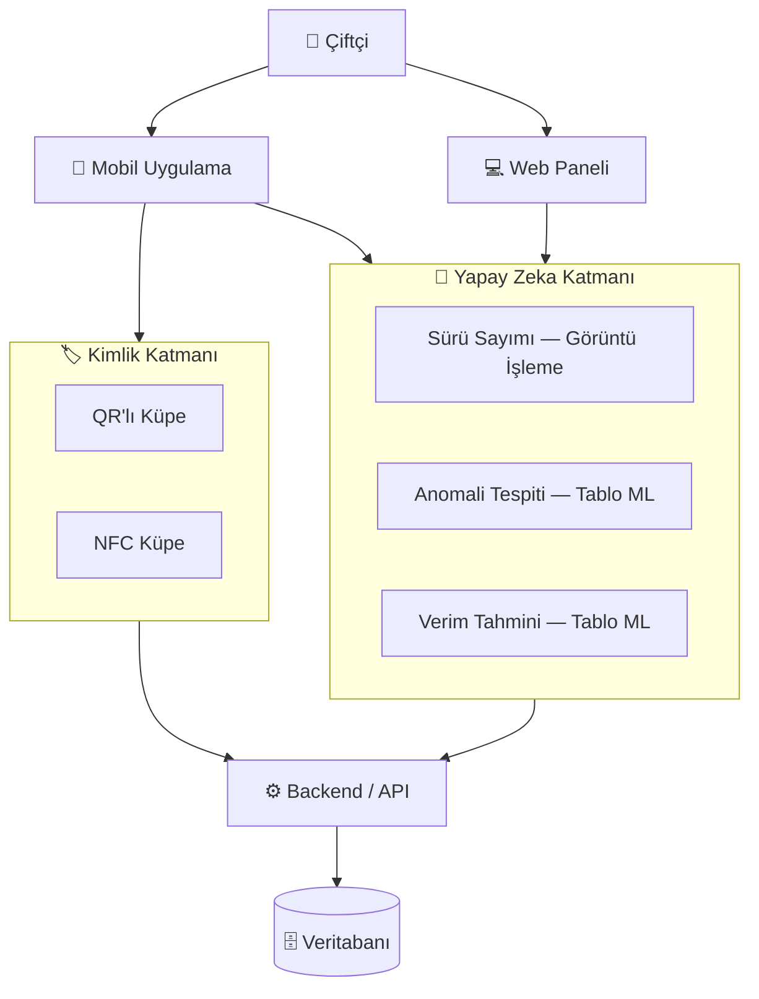
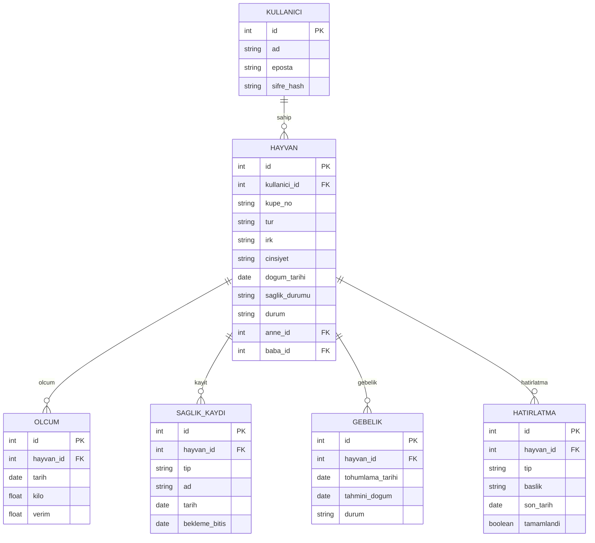

# 🐄 AI Destekli Cepte Veterinerlik

**Sürünü tanı, say, takip et — hepsi cebinden.**

Tarım & hayvancılık için yapay zeka destekli mobil + web sürü yönetim sistemi.

---

## 📖 Bu proje nedir?

Bir çiftçinin ahırdaki hayvanlarını **kimliklendirmesi**, **sayması**, **sağlık ve verim geçmişini takip etmesi** ve veriden **akıllı uyarılar** alması için tasarlanmış bir sistemdir.

Projenin ayırt edici yönü, hazır bir yapay zekayı tüketen bir uygulama olmaktan öte, **kendi modellerinin sıfırdan kurulup entegre edilmesidir.** İki farklı yapay zeka dünyasını bir arada kullanır: ahırda **görüntü işleme** (sürü sayımı) ve kayıt verisi üzerinde **tablo tabanlı makine öğrenmesi** (anomali tespiti, verim tahmini).

> Bitirme Projesi · Yazılım Mühendisliği · ~14 aylık gelişim süreci

---

## ✨ Özellikler

| # | Özellik | Tür | Açıklama |
|---|---------|-----|----------|
| 1 | **Sürü sayımı** | 👁️ Görüntü işleme | Kameraya bir bakışta çerçevedeki hayvanları sayar |
| 2 | **Akıllı hatırlatmalar** | 🔔 Kural mantığı | Aşı zamanı, tahmini doğum, ilaç bekleme süresi uyarıları |
| 3 | **Anomali tespiti** | 🧠 Tablo ML | "Bu hayvanın kilo alımı beklenenin altında" gibi sapmaları yakalar |
| 4 | **Verim / büyüme tahmini** | 🧠 Tablo ML | Zaman serisinden hayvanın gidişatını öngörür |
| — | **Kimlik okuma** | 🏷️ QR + NFC | TÜRKVET küpe numarasını okutup kayda anında ulaşır |

---

## 🏗️ Sistem mimarisi

Projenin temel kararı: **kimlik okumak** ile **yapay zeka** ayrı katmanlardır. Kimlik kesin ve şaşmazdır (küpe); yapay zeka hızlı ve akıllıdır (sayar, analiz eder).

---

## 🗄️ Veri modeli

Şemanın kalbi **HAYVAN + OLCUM** ikilisidir. Anomali ve tahmin tek seferlik kayıtla değil, **zaman içindeki tekrarlı ölçümlerle** çalıştığı için ölçümler ayrı bir tabloda tutulur — bir hayvanın yüzlerce ölçüm satırı olabilir.

**Tablo mantığı**

- **HAYVAN** — çekirdek kayıt. `kupe_no` TÜRKVET numarasıdır ve kimliktir; QR/NFC bu numarayı okur. `saglik_durumu` (sağlıklı / hasta / gözlemde) mobil listede gösterilir. `yaş`, `dogum_tarihi`'nden hesaplanır. `anne_id` / `baba_id` şimdilik kullanılmıyor ama ileride soy ağacı için ucuz bir gelecek yatırımıdır.
- **OLCUM** — zaman serisi. Anomali tespiti ve verim tahmini bu satırlardan beslenir.
- **SAGLIK_KAYDI** — tek tabloyla iki iş: `tip=asi` hatırlatma tetikler, `tip=tedavi` ise `bekleme_bitis` ile "sütü/eti şu tarihe kadar satılamaz" uyarısını taşır.
- **GEBELIK** — tohumlama tarihinden `tahmini_dogum` hesaplanıp doğum hatırlatması üretilir.
- **HATIRLATMA** — tüm uyarıların toplandığı yüzey; "tamamlandı mı" durumu burada yönetilir.

---

## 📱 Mobil — hayvan kartında gösterilecek bilgiler

Küpe no (ID) · Yaş · Cins (tür / ırk) · Cinsiyet · Sağlık durumu · Genel durum (aktif / satıldı / öldü) · Son ölçümler ve yaklaşan hatırlatmalar

---

## 🛠️ Teknoloji yığını

| Katman | Teknoloji |
|--------|-----------|
| Görüntü işleme (sayım) | YOLO ailesi (hazır model + ince ayar) |
| Tablo ML (anomali, tahmin) | Python · scikit-learn / PyTorch _(netleştirilecek)_ |
| Model eğitim ortamı | Google Colab (ücretsiz GPU) |
| Backend / API | _(netleştirilecek)_ |
| Veritabanı | İlişkisel _(motor netleştirilecek)_ |
| Mobil | _(netleştirilecek — NFC için native taraf düşünülecek)_ |
| Web | _(netleştirilecek)_ |

---

## 🗺️ Yol haritası

- [x] Proje kapsamı ve veri modeli
- [ ] **Sürü sayımı** (görüntü işleme) — ilk hedef
- [ ] ML antrenman turu (uçtan uca boru hattı öğrenimi)
- [ ] Anomali tespiti (tablo ML)
- [ ] Verim / büyüme tahmini (tablo ML)
- [ ] Akıllı hatırlatmalar (aşı · doğum · ilaç bekleme)
- [ ] Kimlik: QR küpe → sonra NFC
- [ ] Mobil + web arayüz
- [ ] Backend & veritabanı entegrasyonu
- [ ] _(İleride)_ Soy ağacı & burun deseni ile kimlik tanıma

---

## ⚠️ Sorumluluk notu

Bu sistem bir **karar destek aracıdır**, veteriner hekimin yerini almaz. Uyarılar ve tahminler bilgilendirme amaçlıdır; sağlıkla ilgili kararlarda daima bir veteriner hekime danışılmalıdır.

---

## 📌 Gelecek vizyonu

Proje olgunlaştıkça, sığırın burun deseninden (parmak izi gibi tekildir) küpesiz kimlik tanıma bir **tez uzantısı** olarak eklenebilir. Bu, küpeye alternatif bir kimlik katmanı sunar.

---

*Kimlik kesinliği küpeden, akıl yapay zekadan. Her şey tek bir veritabanında buluşur.*

