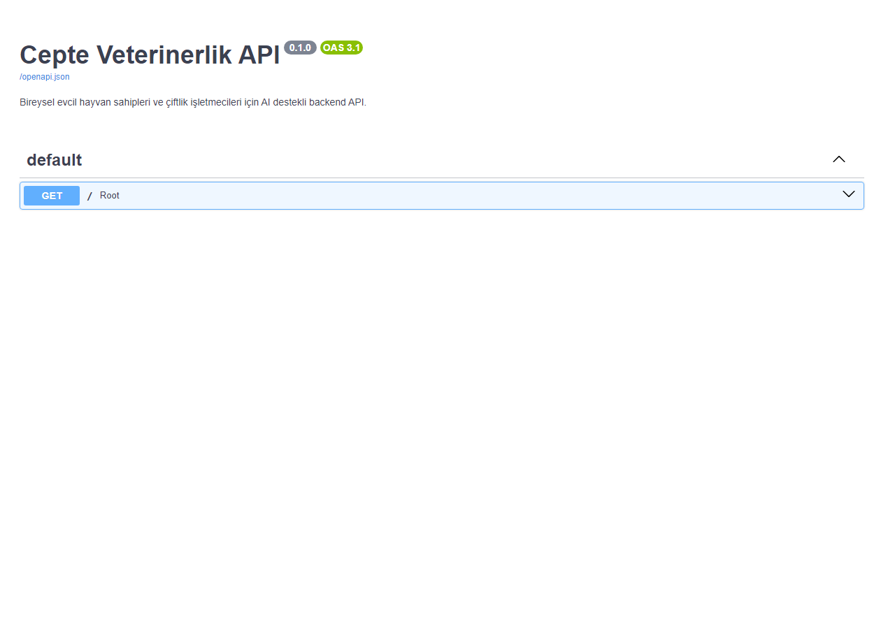
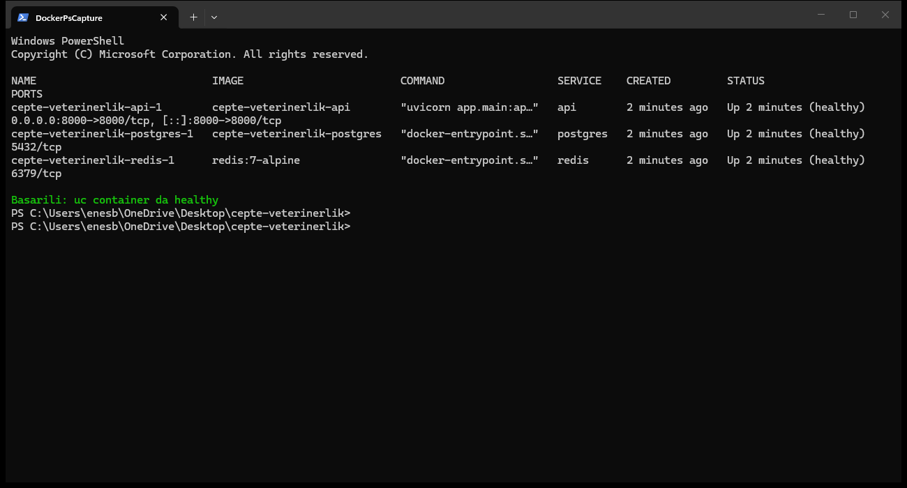
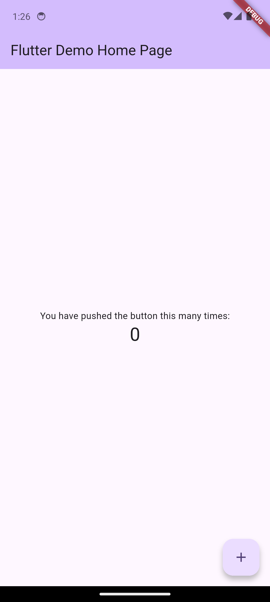

# Gün 1 — Proje İskeleti + Docker

**Tarih:** 2026-08-07
**Commit sayısı:** 4 (+ bu defter)
**Toplam süre:** ~4 saat

---

## Bugün Neler Yaptım

Bitirme projesine resmen başladım. Kamp boyunca yaptığım notebook'lar (YOLO ile
sayım, anomali tespiti, RAG asistan, hava durumu, hatırlatmalar) zaten
`notebooks/` klasöründe duruyordu, bugün onların üzerine gerçek uygulamanın
iskeletini kurmaya başladım — backend, mobil, docker, hepsi tek bir monorepo'da.

İlk iş klasör yapısını kurmak ve LICENSE/editorconfig gibi standart dosyaları
eklemekti, kolay geçti. Sonra backend'e geçtim: Python 3.11 kullanacaktım ama
makinede kurulu değilmiş, 3.12 ile devam ettim — pratikte fark etmiyor. Paket
yöneticisi olarak `uv` kullandım, ilk defa denedim, gerçekten çok hızlı.
FastAPI ile boş bir "hello world" endpoint'i yazıp ayağa kaldırdım.

Docker kısmı beklediğimden zordu. docker-compose ile api+postgres+redis'i
ayağa kaldırmak kolaydı ama Postgres'in Türkçe karakter sıralaması
(`tr_TR.UTF-8` collation) için resmi imajın yeterli olmadığını öğrendim —
kendi Dockerfile'ımı yazıp `localedef` ile locale eklemem gerekti.

Günün en uzun kısmı Flutter kurulumuydu. SDK bile kurulu değildi, indirip
PATH'e eklemem gerekti (bir ara indirme çok yavaş gitti, PowerShell'in
`Invoke-WebRequest` komutunun ilerleme çubuğu render ederken devasa
yavaşladığını öğrendim — kapatınca normale döndü). Android SDK vardı ama
eksik parçaları vardı (build-tools, android-36 platformu), onları da
tamamladım. Sonunda hem Chrome'da hem gerçek bir Android emülatöründe
uygulamayı çalışır halde gördüm, iyi hissettirdi.

---

## Commit 1: Monorepo iskeleti kuruldu, LICENSE ve editorconfig eklendi

**Ne yaptım:**
- backend/, mobile/, docs/, docker/, .github/ klasörlerini açtım
- LICENSE (MIT) ve .editorconfig ekledim
- README'yi güncelledim — artık iki profil (bireysel/çiftlik) anlatılıyor

**Yeni öğrendiğim:**
- **Monorepo:** Birden fazla projenin (backend, mobil) tek bir git deposunda
  tutulması. Ayrı repo açmaktan daha kolay yönetiliyor tek kişilik projede.

---

## Commit 2: FastAPI hello world ve katmanlı klasör iskeleti

**Ne yaptım:**
- `uv` kurdum, backend/pyproject.toml'ı onunla oluşturdum
- app/api, app/services, app/repositories, app/models, app/schemas, app/core
  klasörlerini açtım (katmanlı mimari)
- Basit bir `GET /` endpoint'i yazdım, testini yazdım

**Yeni öğrendiğim:**
- **Katmanlı mimari:** Endpoint'in kendisi iş mantığı içermiyor, işi
  service'e devrediyor, service de veriye repository üzerinden erişiyor.
  Böylece test yazmak ve kod değiştirmek kolaylaşıyormuş.
- **uv:** pip+venv+poetry'nin yerine geçen, Rust ile yazılmış çok hızlı bir
  Python paket yöneticisi.

**Ekran görüntüsü:**

*Swagger `/docs` sayfasında endpoint'i test ettiğimin görüntüsü.*

---

## Commit 3: API için multi-stage Dockerfile ve tam docker-compose stack'i

**Ne yaptım:**
- İki aşamalı (multi-stage) bir Dockerfile yazdım
- Postgres için Türkçe locale ekleyen ayrı bir Dockerfile yazdım
- docker-compose.yml ile üç servisi (api, postgres, redis) birbirine bağladım

**Yeni öğrendiğim:**
- **Multi-stage build:** Bir Docker imajını iki aşamada kurmak — ilk aşamada
  derleme/kurulum yapılıyor, ikinci aşamaya sadece sonuç kopyalanıyor. Böylece
  son imaj gereksiz büyümüyor.
- Resmi postgres imajının sadece İngilizce locale ile geldiğini bugün
  öğrendim, hiç aklıma gelmemişti.

**Ekran görüntüsü:**

*`docker compose ps` çıktısı, üç container da healthy.*

---

## Commit 4: Flutter projesi oluşturuldu, VS Code Android emülatör + Chrome launch config

**Ne yaptım:**
- Flutter SDK kurdum (hiç kurulu değildi)
- Android SDK'daki eksik parçaları (build-tools, platform) tamamladım
- `flutter create` ile mobile/ projesini oluşturdum
- VS Code launch.json'a iki config ekledim: Android Emülatör ve Chrome

**Yeni öğrendiğim:**
- **AVD (Android Virtual Device):** Bilgisayarda çalışan sanal bir Android
  telefon. Gerçek telefon olmadan test edebiliyorsun.
- PowerShell'in `Invoke-WebRequest`'inin varsayılan ayarlarla çok yavaş
  indirdiğini — `$ProgressPreference = 'SilentlyContinue'` ile düzeliyormuş.

**Ekran görüntüsü:**

*Android emülatöründe "Flutter Demo Home Page" ekranı.*

---

## Bugün Zorlandığım Yerler

- **Docker'da Türkçe locale:** İlk denemede `SHOW lc_collate` ile kontrol
  etmeye çalıştım ama garip bir hata aldım, sonunda `pg_database` tablosundan
  `datcollate`/`datctype` ile kontrol edince gördüm ki aslında doğru
  ayarlanmış — sadece `SHOW` komutunun garip davranması sorunmuş, veritabanı
  düzgündü.
- **Flutter/Android kurulumu:** En uzun kısım bu oldu. SDK yok, build-tools
  yok, platform yok — adım adım eksikleri tamamladım. Sabır istedi ama sonunda
  emülatörde uygulamayı görünce değdi.

---

## Yarına Not

Yarın backend'in gerçek iskeletine geçeceğim: pydantic-settings ile config,
loguru ile loglama, health/ready/metrics endpoint'leri. Aklımda kalan soru:
Redis'i ne zaman devreye sokacağız, muhtemelen Gün 5'te auth blacklist için
gerekecek.
